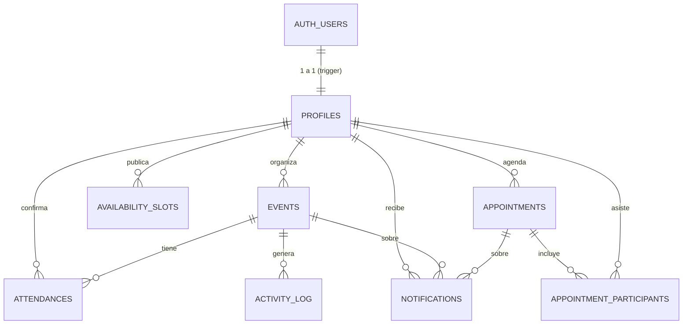

# Especificación de base de datos — Be Core

La fuente de verdad ejecutable es `supabase/migrations/20261001024930_initial_schema.sql`.
Este documento explica qué hace y cómo usarlo. Si este texto y el SQL no coinciden, manda el SQL y se avisa.

## 1. Diagrama entidad–relación



## 2. Tablas

| Tabla | Para qué | Columnas clave | RF |
|---|---|---|---|
| `profiles` | Datos y rol de cada usuario | `id` (= `auth.users.id`), `email`, `full_name`, `role` | RF-01, RF-03 |
| `events` | Eventos | `organizer_id`, `title`, `description`, `category`, `location`, `starts_at`, `ends_at`, `capacity`, `confirmed_count`, `status`, `cancelled_at` | RF-04 a RF-10 |
| `attendances` | Confirmaciones | `event_id`, `user_id`, `status`, `checked_in`, `confirmed_at`, `cancelled_at`. Única por (`event_id`, `user_id`) | RF-11 a RF-13 |
| `availability_slots` | Bloques libres del organizador | `organizer_id`, `starts_at`, `ends_at` | RF-15 |
| `appointments` | Citas y reuniones puntuales | `organizer_id`, `title`, `notes`, `location`, `starts_at`, `ends_at`, `status` | RF-14 |
| `appointment_participants` | Invitados a una cita | PK (`appointment_id`, `user_id`) | RF-14 |
| `notifications` | Bitácora de correos | `user_id`, `type`, `event_id` o `appointment_id`, `subject`, `sent_at`, `error` | RF-16, RF-17 |
| `activity_log` | "Fulano confirmó" para el ticker en vivo | `event_id`, `actor_name`, `action`, `created_at` | RF-18 (dinamismo) |

### Enumerados

| Tipo | Valores | Etiqueta en la interfaz |
|---|---|---|
| `user_role` | `organizer`, `participant` | Organizador, Participante |
| `event_category` | `sport`, `culture`, `recreation`, `other` | Deportivo, Cultural, Recreativo, Otro |
| `event_status` | `scheduled`, `cancelled` | Programado, Cancelado |
| `attendance_status` | `confirmed`, `cancelled` | Confirmado, Cancelado |
| `appointment_status` | `scheduled`, `cancelled` | Programada, Cancelada |
| `notification_type` | `event_reminder`, `event_updated`, `event_cancelled`, `appointment_created`, `appointment_reminder`, `appointment_cancelled` | — |
| `activity_action` | `confirmed`, `cancelled`, `checked_in` | confirmó, canceló, llegó |

"Evento pasado" no es un estado guardado: es `starts_at < now()`. "Evento lleno" tampoco: es
`confirmed_count = capacity`.

### Restricciones que el backend debe respetar (y traducir a errores)

- `capacity` entre 1 y 1000. `confirmed_count` nunca supera `capacity` (constraint
  `events_confirmed_within_capacity`): bajar el cupo por debajo de los confirmados falla con `CAPACITY_BELOW_CONFIRMED`.
- `ends_at` es opcional en eventos y obligatorio en citas; si existe debe ser mayor que `starts_at`.
- Longitudes de texto: ver la columna en el SQL. Los esquemas Zod usan exactamente los mismos límites.

## 3. Registro → perfil (trigger `handle_new_user`)

Al hacer `supabase.auth.signUp` con `options.data = { full_name, role }`, el trigger crea la fila en
`profiles`. Si `role` no es `organizer` o `participant`, el registro completo falla (`INVALID_ROLE`).
El rol queda fijo en `profiles`; no hay endpoint para cambiarlo.

## 4. Lógica de cupos (funciones SQL)

Las dos funciones bloquean la fila del evento con `SELECT ... FOR UPDATE`, así que dos confirmaciones al
mismo tiempo se atienden una detrás de otra. Probado: 50 confirmaciones simultáneas sobre cupo 10 →
exactamente 10 confirmados y 40 `EVENT_FULL`.

### `confirm_attendance(p_event_id uuid, p_user_id uuid) returns integer`

Devuelve el nuevo `confirmed_count`. Orden de validaciones y error que lanza:

1. El evento no existe → `EVENT_NOT_FOUND`
2. `status` no es `scheduled` → `EVENT_NOT_ACTIVE`
3. Ya empezó (`starts_at <= now()`) → `EVENT_STARTED`
4. El usuario es el organizador del evento → `FORBIDDEN`
5. Ya tiene asistencia `confirmed` → `ALREADY_CONFIRMED`
6. `confirmed_count >= capacity` → `EVENT_FULL`
7. Inserta o reactiva la asistencia, suma 1 a `confirmed_count`, escribe en `activity_log`.

### `cancel_attendance(p_event_id uuid, p_user_id uuid) returns integer`

1. No existe → `EVENT_NOT_FOUND`
2. Ya empezó → `EVENT_STARTED`
3. No tenía asistencia `confirmed` → `NOT_CONFIRMED`
4. Marca `cancelled`, resta 1, escribe en `activity_log`.

Uso desde el repositorio:

```js
const { data, error } = await supabaseAdmin.rpc('confirm_attendance', {
  p_event_id: eventId,
  p_user_id: userId,
});
if (error) throw mapDbError(error);   // error.message === 'EVENT_FULL', etc.
return data;                          // número: confirmed_count actualizado
```

Solo el rol `service_role` (la secret key del backend) puede ejecutarlas.

## 5. Seguridad (RLS)

RLS está activo en todas las tablas. El backend usa la secret key, que la ignora. Para el frontend solo
existen tres políticas de lectura: su propio perfil, todos los eventos y todo el `activity_log`
(lo necesario para Realtime). No hay políticas de escritura: el frontend no puede escribir nada directo.

## 6. Realtime

La publicación `supabase_realtime` incluye `events` (para `confirmed_count` y cambios de estado) y
`activity_log` (para el ticker). Ninguna otra tabla se publica.

## 7. Cómo aplicar cambios al esquema

1. `npx supabase migration new nombre_corto` crea un archivo vacío con fecha en `supabase/migrations/`.
2. Escribe el SQL ahí. Nunca edites una migración ya aplicada.
3. Abre PR. Cuando se apruebe, **una sola persona** ejecuta `npx supabase db push`.
4. Avisa al compañero para que haga `git pull`.

Nunca crees ni cambies tablas desde el panel web de Supabase.
